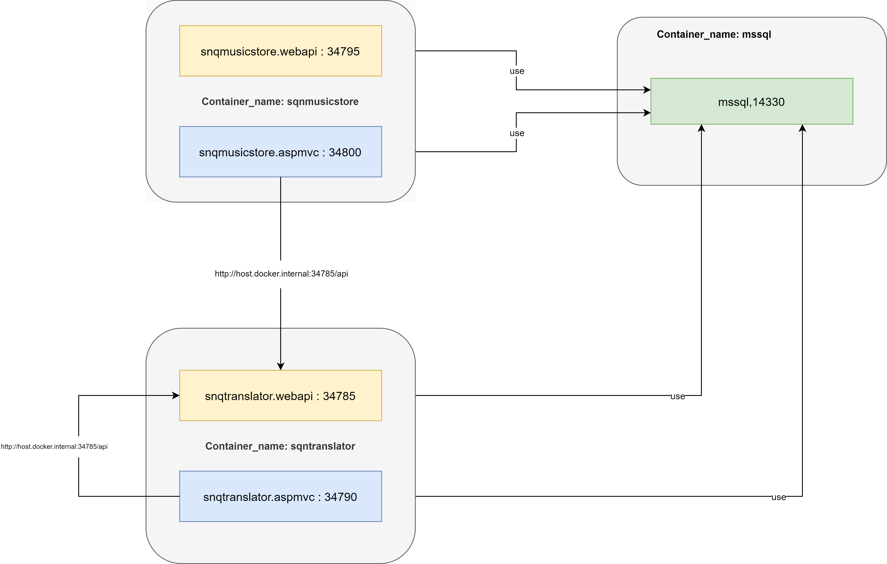

# CSSoftwareEngineering-Docker

## Container-MSSQL

Der MSSQL-Server kann nach belieben konfiguriert werden und in einem eigenen Container gestartet werden. In diesem Scenario wird der Server Standard-Port 1433 nach außen mit 14330 gebunden. Als externes Verzeichnis ist **'C:\Share\Docker\MSSQL'** konfiguriert.


Nachfolgend das Kommando für das Starten des MSSQL-Servers in einem eigenen Container:

### docker-command

> docker run --name mssql -e "ACCEPT_EULA=Y" -e "SA_PASSWORD=passme!1234" -p 14330:1433 -v C:\Share\Docker\MSSQL:/var/opt/mssql/data -d mcr.microsoft.com/mssql/server

## Container-SnQMusicStore

Die MicroApp **'SnQMusicStore'** wird in einem Container gestartet und interargiert mit dem Microsoft SQL-Server in einem anderen Container. Der Web-Service **'snqmusicstore.webapi'** ist mit dem Port 34795 konfiguriert und die Web-App **'snqmusicstore.aspmvc'** mit dem Port 34800. Das entsprechende Docker-compose File befindet sich nach der Abbildung.
 


### docker-compose (SnQMusicStore)

```code
version: '3.4'

services:
  snqmusicstore.webapi:
    image: "snqmusicstorewebapi"
    container_name: snqmusicstore.webapi
    restart: always
    environment:
      - ASPNETCORE_ENVIRONMENT=Production
      - ASPNETCORE_URLS=http://+:80
      - ASPNETCORE_CONNECTIONSTRING=Server=host.docker.internal,14330; Database=SnQMusicStoreDb; User Id=sa;Password=passme!1234
    ports:
      - "34795:80"
    volumes:
      - ${APPDATA}/Microsoft/UserSecrets:/root/.microsoft/usersecrets:ro
      - ${APPDATA}/ASP.NET/Https:/root/.aspnet/https:ro
  snqmusicstore.aspmvc:
    image: "snqmusicstoreaspmvc"
    container_name: snqmusicstore.aspmvc
    restart: always
    environment:
      - ASPNETCORE_ENVIRONMENT=Production
      - ASPNETCORE_URLS=http://+:80
      - ASPNETCORE_CONNECTIONSTRING=Server=host.docker.internal,14330; Database=SnQMusicStoreDb; User Id=sa;Password=passme!1234
    ports:
      - "34800:80"
    volumes:
      - ${APPDATA}/Microsoft/UserSecrets:/root/.microsoft/usersecrets:ro
      - ${APPDATA}/ASP.NET/Https:/root/.aspnet/https:ro
```
  
## SnQMusicStore with SnQTranslator



### docker-compose

```code
version: '3.4'

services:
  snqmusicstore.webapi:
    image: "snqmusicstorewebapi"
    container_name: snqmusicstore.webapi
    restart: always
    environment:
      - ASPNETCORE_ENVIRONMENT=Production
      - ASPNETCORE_URLS=http://+:80
      - ASPNETCORE_CONNECTIONSTRING=Server=host.docker.internal,14330; Database=SnQMusicStoreDb; User Id=sa;Password=passme!1234
    ports:
      - "34795:80"
    volumes:
      - ${APPDATA}/Microsoft/UserSecrets:/root/.microsoft/usersecrets:ro
      - ${APPDATA}/ASP.NET/Https:/root/.aspnet/https:ro
  snqmusicstore.aspmvc:
    image: "snqmusicstoreaspmvc"
    container_name: snqmusicstore.aspmvc
    restart: always
    environment:
      - ASPNETCORE_ENVIRONMENT=Production
      - ASPNETCORE_URLS=http://+:80
      - ASPNETCORE_CONNECTIONSTRING=Server=host.docker.internal,14330; Database=SnQMusicStoreDb; User Id=sa;Password=passme!1234
      - ASPNETCORE_TRANSLATIONSERVER=http://host.docker.internal:34785/api
    ports:
      - "34800:80"
    volumes:
      - ${APPDATA}/Microsoft/UserSecrets:/root/.microsoft/usersecrets:ro
      - ${APPDATA}/ASP.NET/Https:/root/.aspnet/https:ro
```

