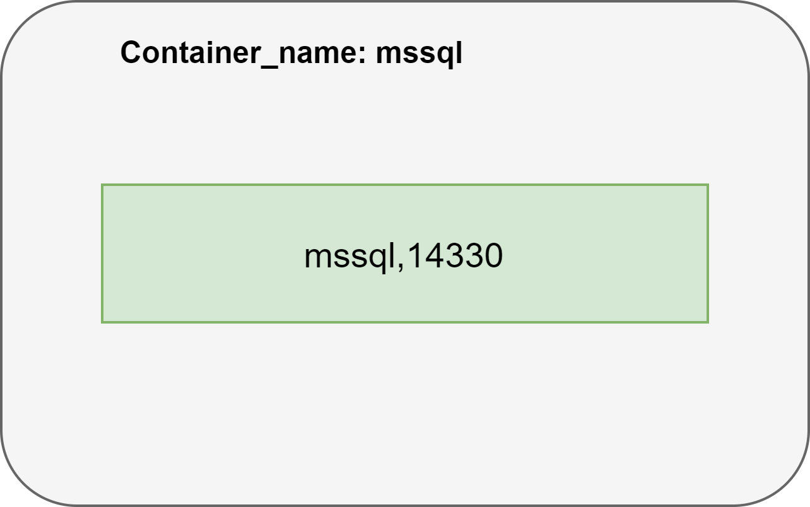

# CSSoftwareEngineering-Docker

## Container-MSSQL

Der MSSQL-Server kann nach belieben konfiguriert werden und in einem eigenen Container gestartet werden. In diesem Scenario wird der Server Standard-Port 1433 nach außen mit 14330 gebunden. Als externes Verzeichnis ist **'C:\Share\Docker\MSSQL'** konfiguriert.



Nachfolgend das Kommando für das Starten des MSSQL-Servers in einem eigenen Container:

### docker-command

```code

docker run --name mssql -e "ACCEPT_EULA=Y" -e "SA_PASSWORD=passme!1234" -p 14330:1433 -v C:\Share\Docker\MSSQL:/var/opt/mssql/data -d mcr.microsoft.com/mssql/server

```

## Container-SnQMusicStore


### docker-compose (SnQMusicStore)

```code
version: '3.4'

services:
  snqmusicstore.webapi:
    image: "snqmusicstorewebapi"
    container_name: snqmusicstore.webapi
    restart: always
    environment:
      - ASPNETCORE_ENVIRONMENT=Production
      - ASPNETCORE_URLS=http://+:80
      - ASPNETCORE_CONNECTIONSTRING=Server=host.docker.internal,14330; Database=SnQMusicStoreDb; User Id=sa;Password=passme!1234
    ports:
      - "34795:80"
    volumes:
      - ${APPDATA}/Microsoft/UserSecrets:/root/.microsoft/usersecrets:ro
      - ${APPDATA}/ASP.NET/Https:/root/.aspnet/https:ro
  snqmusicstore.aspmvc:
    image: "snqmusicstoreaspmvc"
    container_name: snqmusicstore.aspmvc
    restart: always
    environment:
      - ASPNETCORE_ENVIRONMENT=Production
      - ASPNETCORE_URLS=http://+:80
      - ASPNETCORE_CONNECTIONSTRING=Server=host.docker.internal,14330; Database=SnQMusicStoreDb; User Id=sa;Password=passme!1234
      - ASPNETCORE_TRANSLATIONSERVER=http://host.docker.internal:34785/api
    ports:
      - "34800:80"
    volumes:
      - ${APPDATA}/Microsoft/UserSecrets:/root/.microsoft/usersecrets:ro
      - ${APPDATA}/ASP.NET/Https:/root/.aspnet/https:ro
```


## SmartNQuick with SnQTranslator


### docker-compose

```code
version: '3.4'

services:
  smartnquick.webapi:
    image: "smartnquickwebapi"
    container_name: smartnquick.webapi
    restart: always
    environment:
      - ASPNETCORE_ENVIRONMENT=Production
      - ASPNETCORE_URLS=http://+:80
      - ASPNETCORE_CONNECTIONSTRING=Data Source=dbserver; Database=SmartNQuickDb; User Id=sa;Password=passme!1234
    ports:
      - "34785:80"
    depends_on:
      - dbserver
    volumes:
      - ${APPDATA}/Microsoft/UserSecrets:/root/.microsoft/usersecrets:ro
      - ${APPDATA}/ASP.NET/Https:/root/.aspnet/https:ro
  smartnquick.aspmvc:
    image: "smartnquickaspmvc"
    container_name: smartnquick.aspmvc
    restart: always
    environment:
      - ASPNETCORE_ENVIRONMENT=Production
      - ASPNETCORE_URLS=http://+:80
      - ASPNETCORE_CONNECTIONSTRING=Data Source=dbserver; Database=SmartNQuickDb; User Id=sa;Password=passme!1234
      - ASPNETCORE_TRANSLATIONSERVER=http://snqtranslator.webapi/api
    ports:
      - "34790:80"
    depends_on:
      - dbserver
      - snqtranslator.webapi
    volumes:
      - ${APPDATA}/Microsoft/UserSecrets:/root/.microsoft/usersecrets:ro
      - ${APPDATA}/ASP.NET/Https:/root/.aspnet/https:ro
  snqtranslator.webapi:
    image: "snqtranslatorwebapi"
    container_name: snqtranslator.webapi
    restart: always
    environment:
      - ASPNETCORE_ENVIRONMENT=Production
      - ASPNETCORE_URLS=http://+:80
      - ASPNETCORE_CONNECTIONSTRING=Data Source=dbserver; Database=SnQTranslatorDb; User Id=sa;Password=passme!1234
    ports:
      - "34775:80"
    depends_on:
      - dbserver
    volumes:
      - ${APPDATA}/Microsoft/UserSecrets:/root/.microsoft/usersecrets:ro
      - ${APPDATA}/ASP.NET/Https:/root/.aspnet/https:ro
  snqtranslator.aspmvc:
    image: "snqtranslatoraspmvc"
    container_name: snqtranslator.aspmvc
    restart: always
    environment:
      - ASPNETCORE_ENVIRONMENT=Production
      - ASPNETCORE_URLS=http://+:80
      - ASPNETCORE_CONNECTIONSTRING=Data Source=dbserver; Database=SnQTranslatorDb; User Id=sa;Password=passme!1234
      - ASPNETCORE_TRANSLATIONSERVER=http://snqtranslator.webapi/api
    ports:
      - "34780:80"
    depends_on:
      - dbserver
    volumes:
      - ${APPDATA}/Microsoft/UserSecrets:/root/.microsoft/usersecrets:ro
      - ${APPDATA}/ASP.NET/Https:/root/.aspnet/https:ro
  dbserver:
    image: "mcr.microsoft.com/mssql/server"
    container_name: mssql
    restart: always
    environment:
      SA_PASSWORD: "passme!1234"
      ACCEPT_EULA: "Y"
    ports:
      - "14330:1433"
    volumes:
      - "C:\\Share\\Docker\\MSSQL:/var/opt/mssql/data/"```